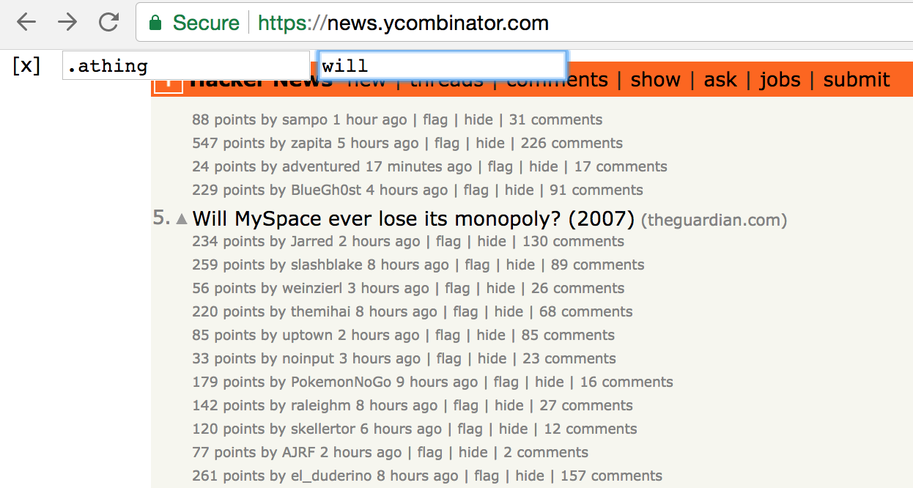

# css-grep

> Greps a regex through DOM elements specified by a CSS selector

This is packaged as a Chrome extension. When activated, the extension puts a
few \<input> elements in the top-left corner of the page:

* the first is a CSS selector to match a set of nodes

* the second is a regex that is matched against the .text() of each node

Any nodes that do not match will be hidden from view. Here is an example of
grepping through the Starbucks hot breakfast table:

## Installation

1. `yarn && yarn build` to compile CoffeeScript and build Chrome manifest

2. In chrome://extensions, enable Developer Mode, and then click "Load
Unpacked" and point to this repo directory

3. (optional) In chrome://extensions/shortcuts, bind a keyboard shortcut

## Development

Run `yarn dev` to do a build, and then re-build on every change.
